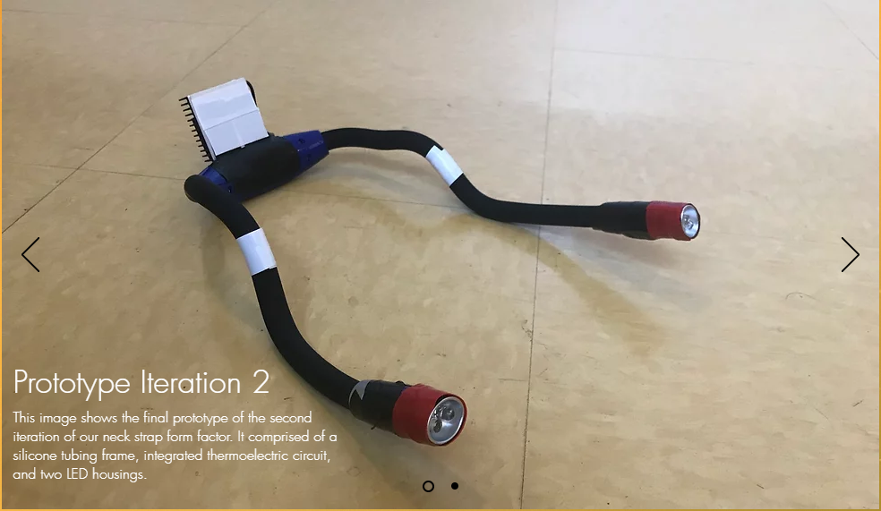
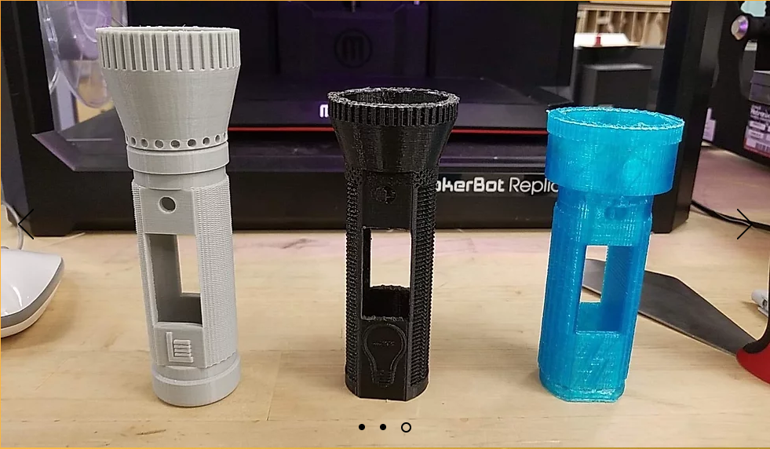
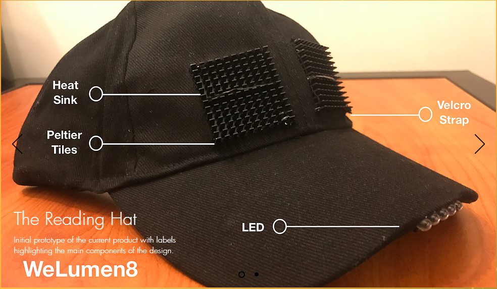

  
  
  

WeLumen8 gives children in developing countries the opportunity to study by providing light to them. Because of limited access to electricity, these children are currently unable to read and study when it is dark. Our mission is to overcome this with an environmentally sustainable, eco-friendly and efficient solution. We wanted to improve the quantity and quality of studying both in houses and in classrooms, making it possible in more parts of the day.

My role in this project was mainly to design flashlight housings for the different iterations of circuits.  The unique feature of our flashlights was that they used a Peltier tile which basically converts heat to electricity that can be used to power the light.  The flashlight design also changed frequently due to new ideas, such as adding a small storage space for matches, a built-in whistle, and even a multi-purpose tool.  We also tried to implement differnt form-factors so that we would have various products.

I greatly improved my computer aided desinging (CAD) skills after completing this project.  I joined the WeLumen8 team about a year after high school and I only knew how to use AutoCAD (2D software).  So this project was very significant to me, since I taught myself how to 3D CAD using the Autodesk software Fusion360.  With this new knowledge, I was able to complete many more projects down the road.

For more information, visit our website [WeLumen8](https://welumen8.wixsite.com/2018).
