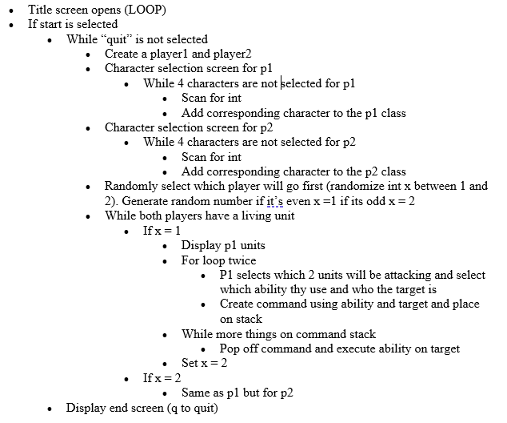

The purpose of this project was to showcase our knowledge on object-oriented programming and implement certain features into a program.  We decided to build a 2 player turn-based battle game, similar to Pokémon.  To explain it briefly, each player will choose four out of the sixteen different characters for their team.  The goal is to eliminate all of the other player’s characters.  Each character has their own move set and stats.  Each player is able to choose up to 2 characters that they want to use per turn.

Along with fabricating a turn-based battle game implementing object-oriented programming, I delegated tasks to team members and kept the team updated on the application’s progress.  We utilized C++ techniques to incorporate features such as unique character classes with stats (health, attack, speed) and moves as well as a targeting and attack order function.

I was able to practice programming with objects during this project and became very comfortable with utilizing them in my future work.  I also learned how to be more patient and persistent.  I believe that the amount of troubleshooting I had to do for this game was very frustrating at times.  But in the end, I learned that sometimes it’s better to take a break for the day and attempt the problem again the following day.

This is a simple algorithm for main structure of our game:

  

To view the whole:

