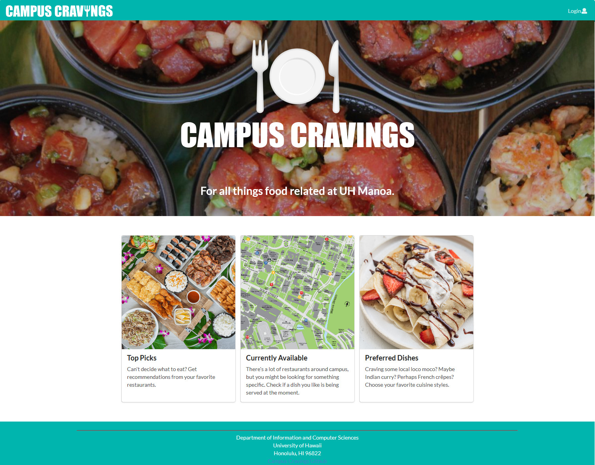

Since University of Hawaii at Manoa’s campus has a variety of food vendors, it can be difficult for students and staff to keep up with what’s available. Many of the locations on campus have different choices, depending what they decide to offer on any given day. There is no easy and concise way to track all of these options and their daily menus: Paradise Palms, campus center, food trucks, etc.

The Campus Cravings app aims to solve this problem by providing an up-to-date resource on everything food related at UH Manoa. Our completed product will allow vendors to create online menus detailing when and where certain dishes will be avaliable. Students will be able to view the food avaliable in the moment as well as browse the top picks of the day.

I was able to practice programming with JavaScript during this project and became very comfortable with utilizing it in my future work.  I also learned how to be more patient and persistent.  I believe that the amount of troubleshooting I had to do for this app was very frustrating at times.  But in the end, I learned that sometimes it’s better to take a break for the day and attempt the problem again the following day.

This is a screen capture of the landing page:

  

To view the project page and source code: [GitHub repository](https://campus-cravings.github.io)

